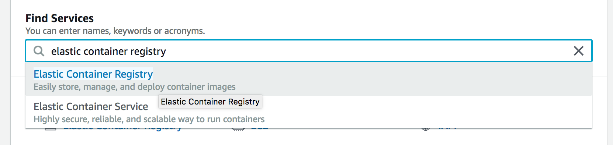
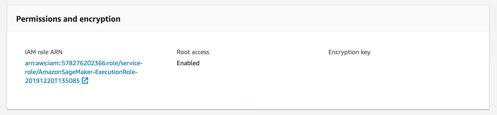
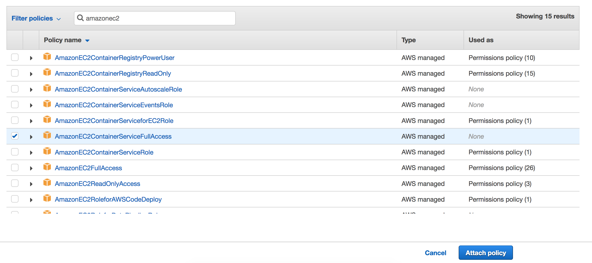

## Custom Docker

This document covers the process of building and deploying a custom Docker container on the Sagemaker platform.

In order to train faster-rcnn on Sagemaker, we need several packages not included in the standard Sagemaker docker container. The process differs from a standard Docker build in only two ways. First, the image must include the Sagemaker Container utilities, and, second, the image must be stored in AWS ECR for so that Sagemaker is able to access the image during training.

Note that we recommend working through this tutorial inside a Sagemaker notebook instance. This will ensure proper access to your AWS account for the purpose of writing to ECR.

## Create ECR Repository

Before building the container, create a a new repository on AWS Elastic Container Registry. In the AWS Management Console, select `elastic container registry`.



Select `Create repository` and pick a name for your new repository.

You'll also need to add ECR access to your Sagemaker role. Open your notebook instance details by clicking the instance name on the Sagemaker notebook instances page. In your notebook instance details, scroll down to `Permissions and encryption`.



Click the link under `IAM role ARN`. Select `Attach Permissions` and attach the `AmazonEC2ContainerServiceFullAccess` policy.



## Build image

The Dockerfile.Sagemaker file included in this repo contains everything needed to replicate the image we used for training on Sagemaker. For the most part, this is a standard Dockerfile, and is based on the default Tensorflow Dockerfile for Sagemaker (the original Dockerfile can be found [here](https://github.com/aws/sagemaker-tensorflow-container/blob/tf-2/docker/2.1.0/py3/Dockerfile.gpu)). 

A few important notes about what makes this image work in Sagemaker:

Section 6 configures the necessary SSH settings to allow the container to communicate across instances, in the case of multinode training on Sagemaker.

Section 7 adds utilites that allow the container to communicate with S3, as well as record instance information used by Sagemaker's monitoring utilities.

Everything through section 7 is the same as the default Sagemaker Tensorflow container. Section 8 adds additional utilities used by faster rcnn.

Finally, note that any Sagemaker container should use `bin/bash` as its entry command.

Let's say I want to build this image, push one copy to Dockerhub and another to AWS ECR:

```
########################################################################
# Build docker image
########################################################################

cd /home/ec2-user/SageMaker/mmdetection_tf/docker
DOCKERHUB_USER=johnbensnyder
IMAGE_NAME=sagemaker-tf-frcnn:2.1.0
docker build -t ${DOCKERHUB_USER}/${IMAGE_NAME} -f Dockerfile.frcnn .

##################################################################
# Push to Dockerhub
##################################################################

docker login
docker push ${DOCKERHUB_USER}/${IMAGE_NAME}

########################################################################
# login to ECR
########################################################################

ECR_USER=jbsnyder # this should be the name of the ECR repository you created earlier
ALGO_NAME=sagemaker-tf-frcnn-2.1.0 # note that this is different than the dockerhub name since it is all the image tag
region=$(aws configure get region)
account=$(aws sts get-caller-identity --query Account --output text)
fullname="${account}.dkr.ecr.${region}.amazonaws.com/${ECR_USER}:${ALGO_NAME}"
$(aws ecr get-login --region ${region} --no-include-email)

########################################################################
# Tag image to ECR repo and push
########################################################################
docker tag ${DOCKERHUB_USER}/${IMAGE_NAME} ${fullname}
docker push ${fullname}
```

Changing the variables with names in all caps should be enough to modify this code to your own image.

You can then get your image name on ECR with `echo $fullname`. Use this name for the `image_name` variable in the `launch_sagemaker.ipynb` notebook.